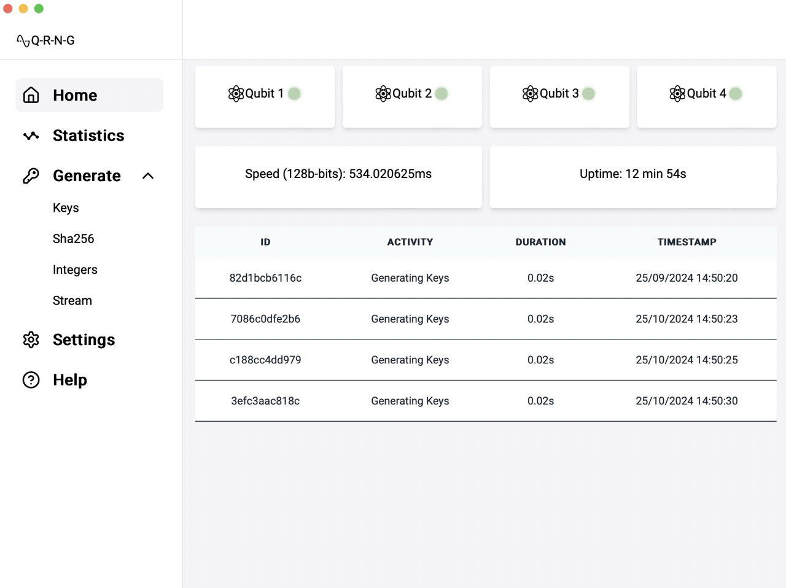
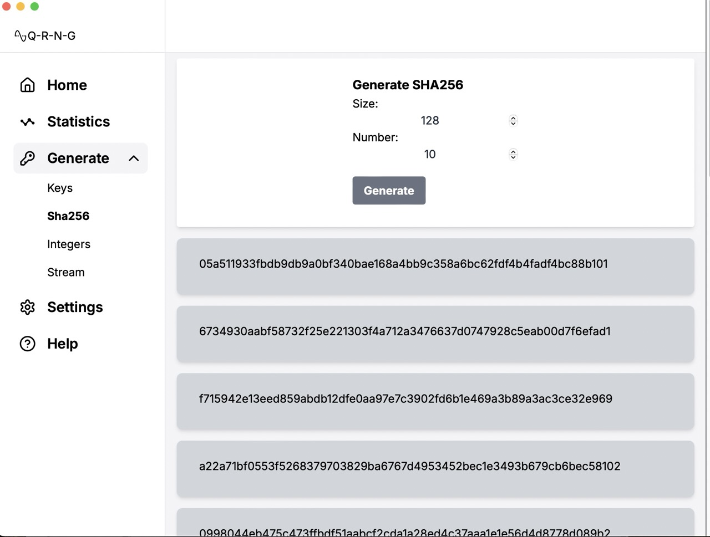

  

# GUI

This is a cross-platform graphical user interface (GUI) for the 
[quantum random number generator (QRNG) project](https://www.github.com/KevinFasusi/qrng/).

Use the CLI to 

## 😎 Features

- Generate random:
    - initialisation vectors
    - private keys
    - integers
    - hash digests
- View summary statistics for the generator activity
- Keep and search an activity log. 

